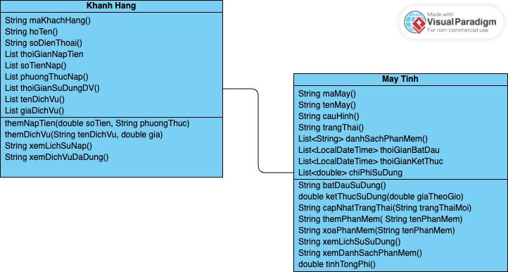
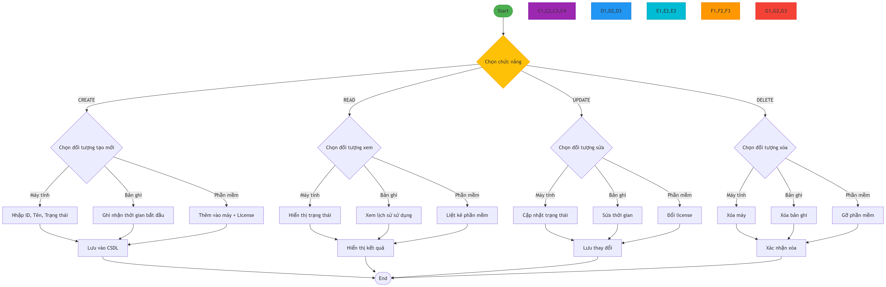

## Thành viên
1. Nguyễn Thị Kim Oanh - 24100459
2. Hoàng Nhật Bảo Trâm - 24100260
## 1. Nội Dung
### Xây dựng ứng dụng quản lý quán net
1. Quản lý khách hàng
   - Thêm, sửa, xoá tên khách hàng
   - Lưu trữ thông tin cá nhân: mã khách hàng, họ tên, số điện thoại
   - Xem lịch sử nạp tiền
   - Theo dõi các dịch vụ đã sử dụng (game, internet, đồ uống...)
2. Quản lý máy tính
   - Theo dõi trạng thái máy (đang hoạt động, bảo trì, hỏng)
   - Ghi nhận thời gian bắt đầu/kết thúc sử dụng
   - Cập nhật danh sách phần mềm/game trên các máy
   - Tính toán thời gian sử dụng và chi phí phát sinh
## 2. Sơ đồ khối yêu cầu
### 2.1 UML class diagram

### 2.2 UML activity diagram
Class Khách Hàng

Class May Tinh

