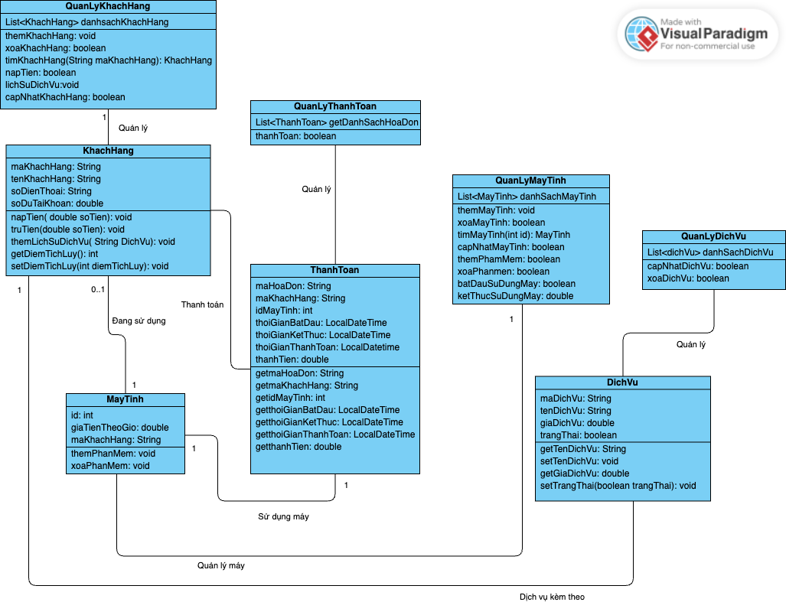
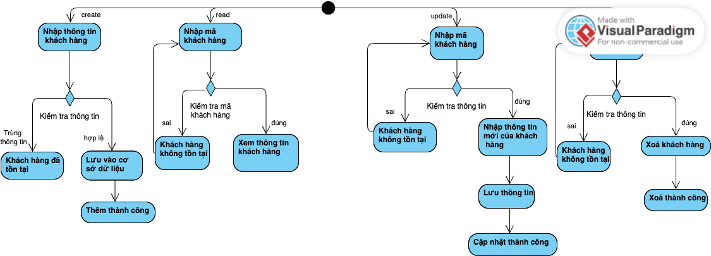
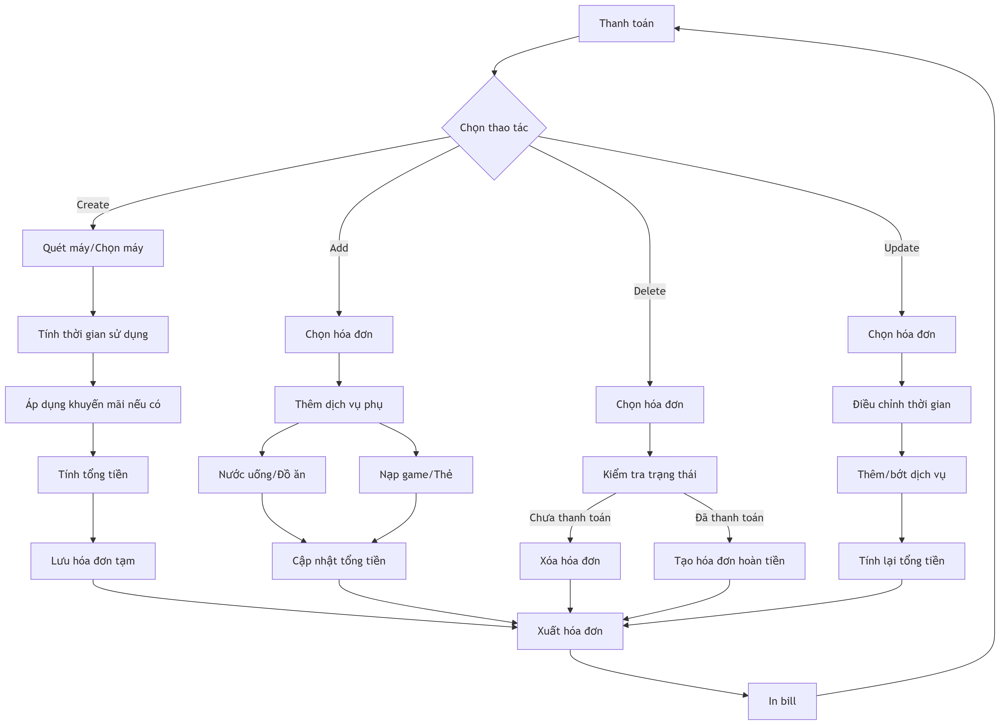
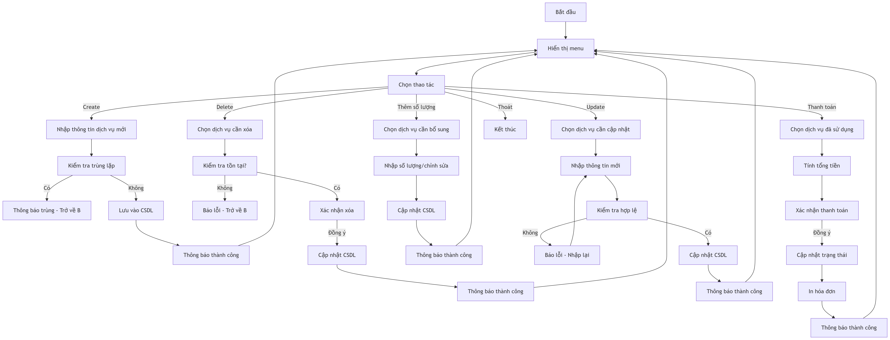
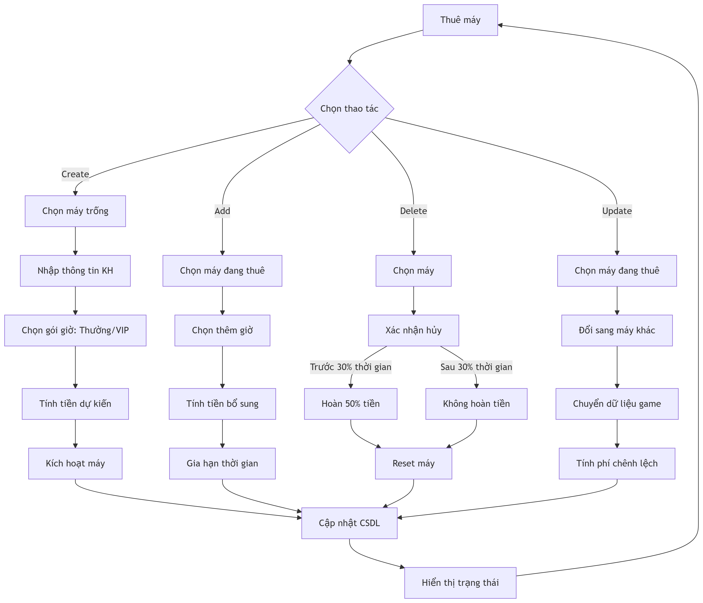

<h1 align="center">Ứng Dụng Quản Lý Quán Net 👩🏻‍❤️‍👩🏻 </h1>

  📚 <strong>Java OOP Project</strong> – Nhóm 3: <code>OOP_N05_T3_2025_GROUP_Tram_Oanh</code> 

## 📍 Giới thiệu Dự án

**Ứng dụng Quản lý Quán Net** là giải pháp phần mềm toàn diện giúp chủ quán net quản lý hoạt động kinh doanh một cách hiệu quả và chuyên nghiệp.

### 🌟 Tính năng nổi bật

#### 👤 Quản lý Khách hàng
- 📝 Đăng ký/Chỉnh sửa thông tin khách hàng
- 💳 Hệ thống thẻ thành viên tích điểm
- 📊 Theo dõi lịch sử giao dịch
- 🛎️ Quản lý yêu cầu dịch vụ kèm theo

#### 🖥️ Quản lý Máy tính
- � Phân loại theo trạng thái (Đang hoạt động / Bảo trì / Trống)
- ⚙️ Quản lý cấu hình phần cứng
- 📦 Kiểm soát phần mềm cài đặt sẵn
- ⏱️ Tính giờ sử dụng tự động

#### 💰 Hệ thống Thanh toán
- 🧮 Tính tiền theo thời gian sử dụng
- 📈 Cộng dồn dịch vụ phát sinh
- 🖨️ Xuất hóa đơn chi tiết
- 📉 Xem số dư còn lại

## 🛠️ Sơ đồ

### Sơ đồ class diagram

### Sơ đồ activiy
##### 1. CRUD_KhachHang

##### 2. CRUD_MayTinh

##### 3. CRUD_ThanhToan

##### 4. CRUD_DichVu

##### 5. CRUD_ThueMay

## 🚀 Công nghệ sử dụng
- **Ngôn ngữ**: Java 17
- **Mô hình**: OOP 
- **Lưu trữ**: File text 

## 👩‍💻 Thành viên nhóm
| STT | Họ tên | MSSV | Github | Liên hệ |
|-----|--------|------|---------|-----------|
| 1 | Hoàng Nhật Bảo Trâm | 24100260 | https://github.com/hnbtram | 24100260@st.phenikaa-uni.edu.vn |
| 2 | Nguyễn Thị Kim Oanh | 24100459 | https://github.com/oanhmau | 24100459@st.phenikaa-uni.edu.vn |

## Liên kết dự án
- link repo Readme: https://github.com/hnbtram/OOP_N05_T3_2025_TRAM_OANH/blob/main/README.md
- link codespace: https://fluffy-palm-tree-g47pq566xxxvcv5rx.github.dev/
- link public: https://fluffy-palm-tree-g47pq566xxxvcv5rx8080.app.github.dev/netOanhTram
- link Youtube-demo: https://youtu.be/JHfYlQTClxQ

## 📞 Liên hệ
- **Giảng viên hướng dẫn**: Nguyễn Lệ Thu
- **Lớp**: OOP_N05 - Kỳ 3 năm 2025

  <em>Dự án được phát triển vì mục đích học tập</em>

